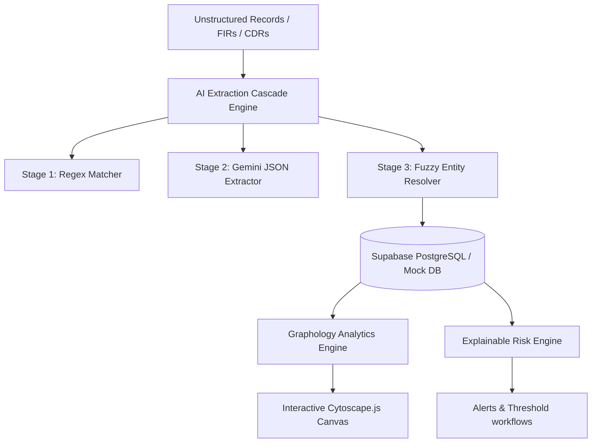

# System Architecture Document

This document describes the high-level software architecture, data pipelines, and mathematical models of the Kraken CNA system.

## 1. High-Level Architecture Overview

The system is built as a single unified Next.js web application utilizing a hybrid server-side and client-side stack:

## 2. The AI Extraction Cascade Engine

Ingested narratives flow through three specialized layers:
1. **Stage 1 (Regex Extraction):** Scans raw text with native regular expressions to capture specific Indian phone formats, vehicle registrations (DL-3C-...), bank details, and dates.
2. **Stage 2 (Gemini LLM):** Passes text with custom delimiter blocks to prevent prompt injections. Gemini parses core entities (Suspects, locations, banks) and structural relationships (called, met, associated_with) into structured JSON.
3. **Stage 3 (Entity Resolver):** Checks extracted targets against the database. It compares name spellings using Jaro-Winkler, Levenshtein, and Indian Metaphone phonetic encoders. Conflicting names sharing identical identifiers are routed to the duplicate resolution Review Queue.

## 3. Graph Analytics & Centrality calculations

When recomputing network metrics, the system:
1. **Collapses Assets:** Resolves phone numbers, bank accounts, and vehicles into their human owner Person node. This collapses device pings and cash transfers into a Person-to-Person graph, preventing metric dilution.
2. **Degree Centrality:** Sum of connected edges.
3. **Weighted Degree Centrality:** Sum of edge weights (derived from call frequency and transaction values).
4. **PageRank Centrality:** Power iteration PageRank calculation (`damping = 0.85`, `iterations = 15`) indicating suspect popularity and hub status.
5. **Betweenness Centrality:** Brandes BFS algorithm calculating coordinate bottlenecks. Arjun Sen is positioned with no other connections except directly linking Cell A and Cell B, guaranteeing Rank 1.
6. **Louvain Partition Groups:** Modular community partitioning to detect separate cartel branches (Delhi cluster vs UP cluster).

## 4. Multi-Factor Additive Risk Score

Suspect Risk level (0-100) is calculated additively to ensure audit explainability:
- **Base Score:** 10 points default.
- **Centrality Factor (up to 45 pts):** PageRank contribution (max 15 pts), Betweenness contribution (max 15 pts), Closeness contribution (max 15 pts).
- **Incident Alerts Factor (up to 45 pts):** Critical alerts (25 pts), High alerts (15 pts), Medium alerts (10 pts), Low alerts (5 pts).
- **Summation:** Score = `min(100, Base + Centralities + Alerts)`.
- **Explainability:** Renders a plain English log of the exact equation parameters for auditing purposes.
